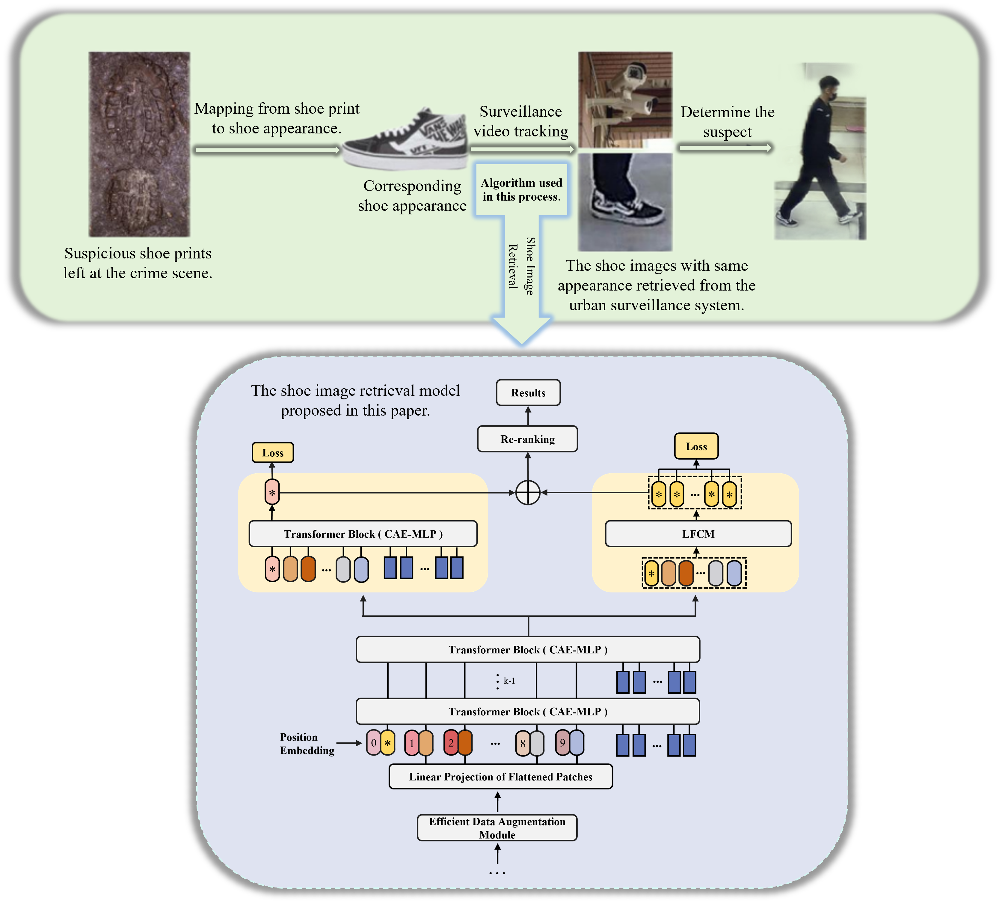

# ViT-SIR
Vision Transformer-based Shoe Image Retrieval with Enhanced Feature Representation

# Installation
pip install -r requirements.txt
# Train
python train.py --config_file configs 'XXX'
eg.python train.py --config_file configs/Shoes/vit_train.yml
# Test
python test.py --config_file 'XXX' TEST.WEIGHT 'XXX'
eg.python test.py --config_file configs/Shoes/vit_test.yml TEST.WEIGHT 'choose the trained weight'
